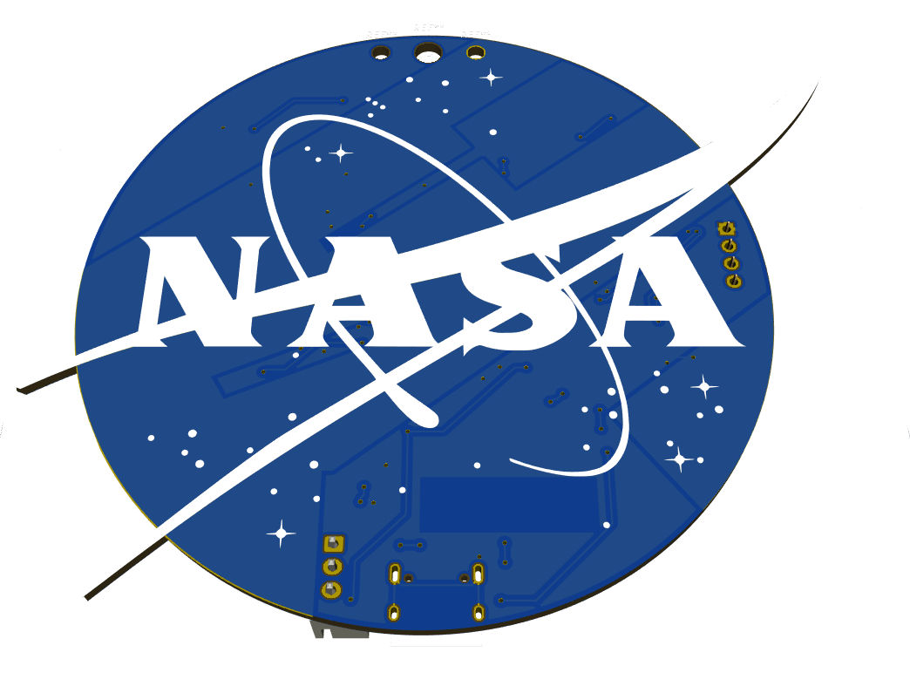

# Meatball Badge

Wear the NASA meatball logo as a PCB lanyard badge.

Features:
- illuminated vector and stars (reverse mounted LEDs)
- programmable via Arduino IDE
- ESP32 MCU
- USB Type C interface
- Li-ion battery

For (interactive) BOM see the [Instructions page](https://cybre-finn.github.io/meatball-badge/) (german).

