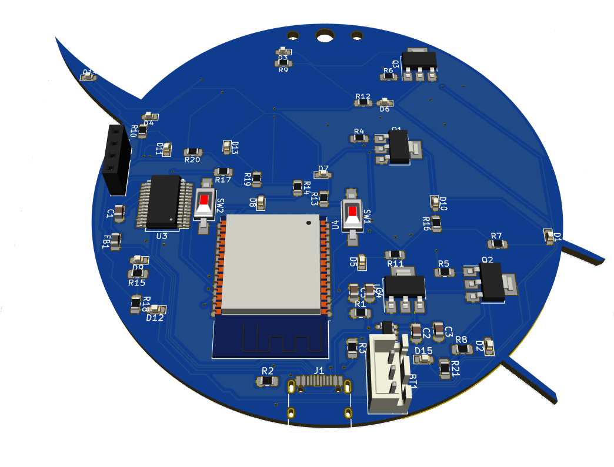

# Github pages Test
Das meatball-badge ist ein PCB-Badge in Form des Nasa-Meatball-Logos.



Den Abschnitt "Zusammenbau" vor Beginn bitte komplett durchlesen.

## Zusammenbau
Das meatball-badge ist ein SMD-Lötworkshop. SMD/SMT steht für "Surface Mounted Device" oder "Surface Mounted Technology". Im Gegensatz zu THT "Through Hole Technology" werden die Bauteile nicht durch Löcher auf der Platine gesteckt, sondern auf der Platine befestigt.
Dadurch wird der benötigte Platz reduziert und die Bauteile können maschinell durch sogenannte (Pick-and-Place-Maschinen)[https://en.wikipedia.org/wiki/Pick-and-place_machine] und (Reflow-Öfen)[https://en.wikipedia.org/wiki/Reflow_soldering] befestigt werden.

Das händische Löten von SMD kann zuerst etwas schwierig sein und erfordert etwas Übung. Die auf diesem Badge verwendeten Bauteile sind allerdings bis auf die LEDs etwas größere SMD-Varianten. 

Wenn man das noch nie gemacht hat, dann gibts hier eine (Anleitung in Comic-Form)[http://mightyohm.com/files/SMT_Soldering_Its_Easier_Than_You_Think_EN.pdf].

### Kathoden- und Annodenseite der LEDs
Da die SMD-LEDs keine unterschiedlichen Beinlängen haben, wird die Polarität der LED durch einen Aufdruck bestimmt. Bei unseren LEDs ist das ein T-Förmiger aufdruck.
```
Kathode(-)
   T
Annode(+)
```

### LED-Hack
Die SMD-LEDs beleuchten den roten Vektor und die 5 Sterne von hinten. Dafür müssen die LEDs umgedreht aufgelötet werden. Also so, dass die Beschriftung sichtbar ist. Das ist eigentlich nicht die gedachte Anwendung dieser dieser LEDs. Aufgrund der Form könnte das etwas schwieriger werden. Daher sind ein paar mehr LEDs beigelegt.

### Butter bei die Fische
Ganz praktisch ist das iBOM-Tool. Damit kann interaktiv die Bestückung im Browser durchgegangen werden. Es empfiehlt sich, das Tool auf einem grösseren Display aufzurufen.

(IBOM)[ibom]

Nicht vergessen: Die LEDs müssen gedreht werden.

### Sichterheitshinweis
Diesem Badge liegt eine Lithium-Batterie bei. Es ist unbedingt darauf zu achten, dass die Kontakte nicht kurzgeschlossen werden und die Batterie niemals beschädigt wird. Die Nutzung geschieht auf eigene Verantwortung.

## Erstes Programm
Alle drei LED-Arrays and den Transistoren blinken.

```{C}
int LED_RED_1 = 19;
int LED_RED_2 = 21;
int LED_WHITE = 22;
void setup() {
pinMode (LED_RED_1, OUTPUT);
pinMode (LED_RED_2, OUTPUT);
pinMode (LED_WHITE, OUTPUT);
}
void loop() {
digitalWrite(LED_RED_1, HIGH);
digitalWrite(LED_RED_2, HIGH);
digitalWrite(LED_WHITE, HIGH);
delay(1000);
digitalWrite(LED_RED_1, LOW);
digitalWrite(LED_RED_2, LOW);
digitalWrite(LED_WHITE, LOW);
delay(1000);
}
```
